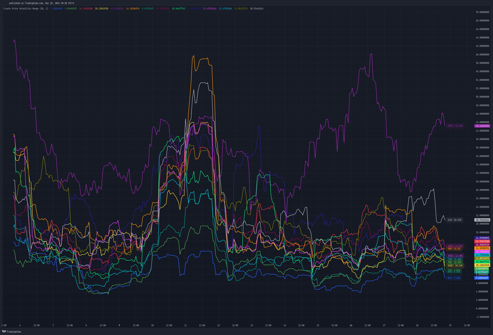

# Cryptocurrency Price Volatility Range Indicator

This TradingView indicator is a visualization tool for tracking historical volatility across multiple major cryptocurrencies.

## Features

- Real-time volatility tracking for 14 major cryptocurrencies
- Customizable period and standard deviation multiplier
- Individual color coding for each currency pair
- Optional labels showing current volatility values in percentage

## Supported Cryptocurrencies

- Bitcoin (BTC)
- Ethereum (ETH)
- Avalanche (AVAX)
- Dogecoin (DOGE)
- Hype (HYPE)
- Ripple (XRP)
- Binance Coin (BNB)
- Cardano (ADA)
- Tron (TRX)
- Chainlink (LINK)
- Shiba Inu (SHIB)
- Toncoin (TON)
- Sui (SUI)
- Stellar (XLM)

## Settings

- **Period**: Timeframe for volatility calculation (default: 20)
- **Standard Deviation Multiplier**: Multiplier for standard deviation (default: 1.0)
- **Show Labels**: Toggle label display on/off

## Calculation Method

The indicator calculates volatility using the following method:

1. Calculate daily logarithmic returns
2. Compute standard deviation over the specified period
3. Annualize (multiply by √252)
4. Convert to percentage (×100)

## Usage

1. Add the indicator to your TradingView chart
2. Adjust parameters as needed
3. Monitor volatility lines for each cryptocurrency
4. Enable labels to see precise current volatility values

## Notes

- This indicator displays in a separate window, not as an overlay
- Volatility values are annualized
- Data for each currency pair is sourced from USD pairs

## License

MIT License 